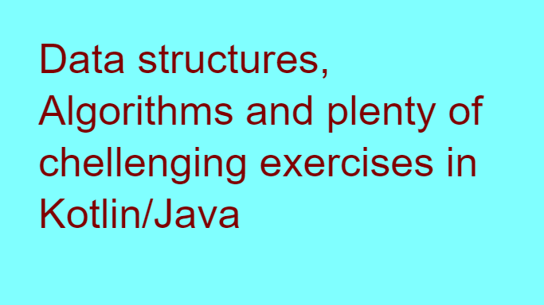

# Data Structures, Algorithms and programming exercises

This repository contains Data structures and Algorithms implementations in Kotlin (mostly) and Java that i have created when taking the course https://www.udemy.com/course/master-the-coding-interview-data-structures-algorithms/

I also has several exercises solved (from leetcode, hackerrank, codewars etc) that are meant to train and improve my skills in software engineering.

### Overview
- [Data Structures](https://github.com/ElementalistBTG/Data_Structures/tree/master/src/main/kotlin/data_structures)
    - Arrays
    - Hash Tables
    - Linked Lists
    - Stacks
    - Queues
    - Trees (with searching algorithms)
    - Graphs
- [Algorithms](https://github.com/ElementalistBTG/Data_Structures/tree/master/src/main/kotlin/Algorithms)
    - Recursion
    - Sorting
    - Bubble Sort
    - Selection Sort
    - Insertion Sort
    - Merge Sort
    - Quick Sort
- [Dynamic Programming](https://github.com/ElementalistBTG/Data_Structures/tree/master/src/main/kotlin/dynamic_programming)
    - Memoization
    - Dynamic Fibonacci

